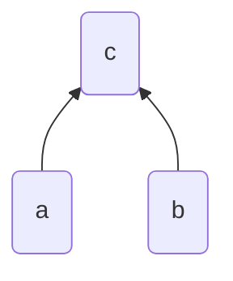
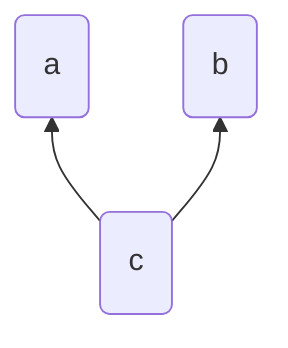
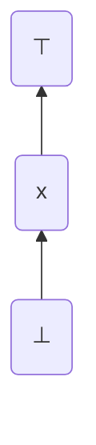
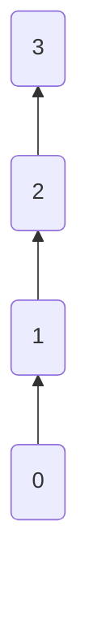
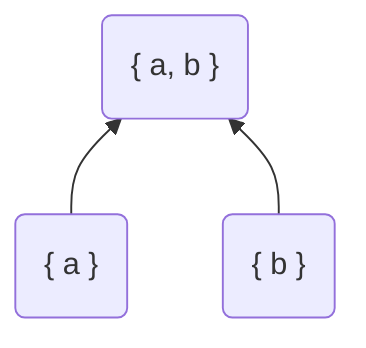
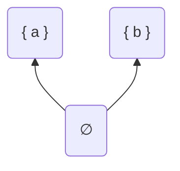
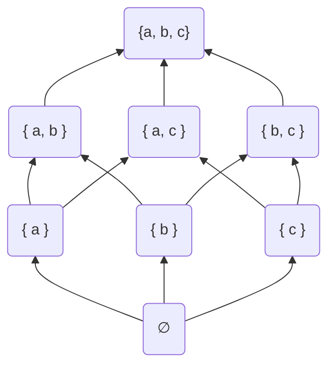
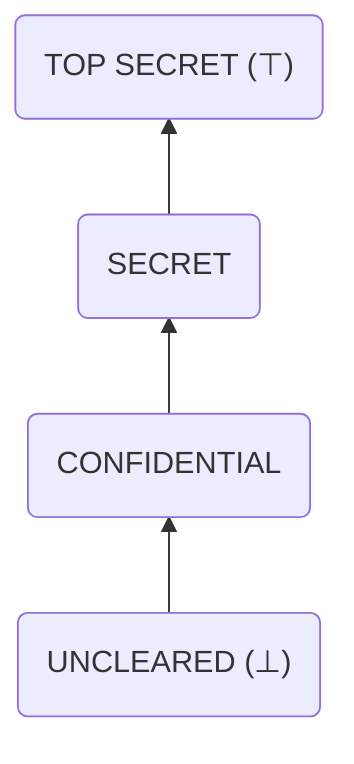
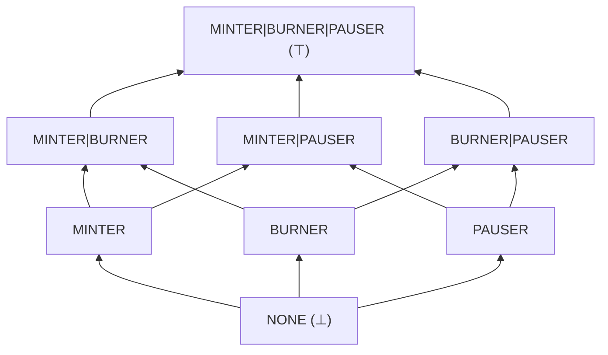
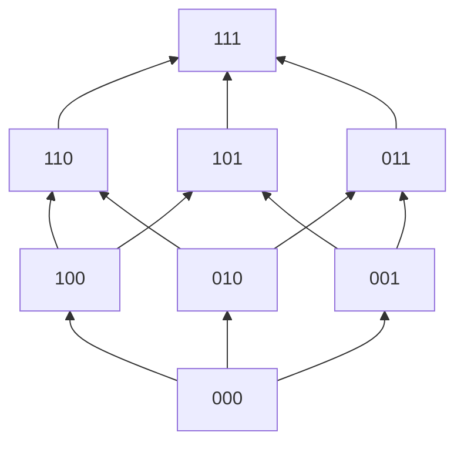

# Authority Lattice Hierarchies

For context, see the [introductory section](#introduction).

For integration guidance, see the [integration section](#integration).

## Introduction

Order lattice structures create a natural account hierarchy which covers all current use cases for
individual account authorities in smart contract environments. We define a core authority lattice
system under a generic `cleared(account,authority)` structure which checks an account's authority in
the contract state against an authority threshold. The `cleared` function resolving to `true`
signals the account is cleared for the given authority. We also define a system for accounts to
migrate their authority in a two-step process similar to ownable contracts with a two-step process
to mitigate migration mistake risk. Finally, we define two lattice structures, the linear lattice
and the role power set lattice, each of which defines their own `cleared` function, each of which
giving rise to two extensible classes of authority.

### Lattice Foundations

A lattice is an abstract structure consisting of a partially ordered set where every pair of
elements has a unique supremum and unique infimum. That is to say most (possibly but not necessarily
all) elements can be compared for their ordering against one another. In an intuitive sense, this
comparison operation may be a "less than or equal to" check but algebraically it is abstract and
only has to satisfy a few properties, explored below. The supremum and infimum requirement
intuitively means that for any two element subset (in our case, authority levels), there exists some
unique element (authority) which is above those two, additionally there exists some unique element
(authority) under those two.

More rigorously, We define the set $L$ and a comparison operator $\leq$ such that it is:

**Reflexive**, that is an element is comparable with itself:

$$a \in L : a \leq a$$

**Transitive**, that is order relations compose ($\And$ is a logical "AND"):

$$a, b, c \in L : a \leq b \And b \leq c \implies a \leq c$$

**Antisymetric**, that the only case in which the order of the elements in a comparison *don't* matter
is when they are the same element:

$$a, b \in L : a \leq b \And b \leq a \implies a = b$$

The "partial" component of the ordering means that not all elements necessarily need to be
comparable. A "total" order, on the other hand necessitates that all elements are comparable.

The unique supremum of any two elements is a third element which is directly above those two.

$$a, b, c \in L$$
$$a \lor b = c$$
$$a \leq c$$
$$b \leq c$$



The unique infimum of any two elements is a third element which is directly below those two.

$$a, b, c \in L$$
$$a \land b = c$$
$$c \leq a$$
$$c \leq b$$



Creating a bounded hierarchy means there exists unique "top" $\top$ and "bottom" $\bot$ elements
such that all element are above the bottom and all elements are below the top.

$$\exists \bot, \top \in L$$
$$\forall x \in L$$
$$\bot \leq x \leq \top$$



#### Chain Lattices

Lattices defined by number comparison use the $\leq$ operator (proper) as its choice for ranking.
We refer to these as chain lattices.

We'll use a small subset of the integers $\{ 0, 1, 2, 3 \}$ for intuition, but this behaves the same
for any set of numbers with a comparision operation.

For any two numbers $a, b \in \{ 0, 1, 2, 3 \}$, we define the unique supremum of them to be the
greater of the two, infimum is the lesser of the two, the top to be $3$ and the bottom to be $0$
such that:

$$\forall a, b, \in \{ 0, 1, 2, 3 \}$$
$$a \leq b \implies a \lor b = b$$
$$b \leq a \implies a \lor b = a$$
$$0 \leq a$$
$$a \leq 3$$

This creates a direct, linear hierarchy akin to security clearances.



#### Power Set Lattices

Lattices defined by subset inclusion use the $\subseteq$ operator as its choice for ranking. We
refer to these as power set lattices.

We'll use a set $L = \{ a, b, c \}$ and derive its hierarchy from its powerset where subset
inclusion implies authority.

$$P(L) = \{ \{ a\}, \{ b \}, \{ c \}, \{ a, b \}, \{ a, c \}, \{ b, c \}, \{ a, b, c \} \}$$

For any two subsets $A, B \subseteq L$, we define a subset which is directly above them,
$C \subseteq L$.

Concretely, we may define $A = \{ a \}$ and $B = \{ b \}$ such that $C = \{ a, b \}$.

$$\{ a \}, \{ b \}, \{ a, b \} \subseteq L:$$
$$\{ a \} \lor \{ b \} = \{ a, b \}$$
$$\{ a \} \subseteq \{ a, b \}$$
$$\{ b \} \subseteq \{ a, b \}$$



Additionally, for any two subsets $A, B \subseteq L$, we define an element which is directly below
them, $C \subseteq L$.

Concretely, we may define $A = \{ a \}$ and $B = \{ b \}$ such that $C = \varnothing$


$$\{ a \}, \{ b \}, \varnothing \subseteq L:$$
$$\{ a \} \land \{ b \} = \varnothing$$
$$\varnothing \subseteq \{ a \}$$
$$\varnothing \subseteq \{ b \}$$




In the context of $L$, the bottom element would be $\varnothing$ and the top element would be $L$
itself.

$$\forall x \in L : \bot \leq x \leq \top$$
$$\forall x \in L : \varnothing \leq x \leq L$$



### Authority Lattice

The core authority lattice defines only a map of account-authority pairs where the authority is
stored as a 256-bit integer. The structure of this integer and clearance checking are opaque, meant
to be implemented downstream by the [`LinearAuthorityLattice`](#linear-authority-lattice) and
[`RolePowerSetLattice`](#role-power-set-lattice).

```solidity
// This is the clearance check which is defined downstream.
function cleared(address account, uint256 expectedAuthority) public view returns (bool);
```

The only functionality this abstract contract provides is the authority to update accounts to only
the top $\top$ authority (admin).

> Note that one or many accounts can hold the top authority, this authority can also be renounced.

### Two Step Authority Transitions

An emergent process for authority transitioning in smart contracts is via the two-step process. This
ensures that an `owner` account can transfer ownership such that if the ownership transfer is
incorrect and sent to an address which cannot execute transactions (ie the private key is unknown).

We make this an optional dependency, as some hierarchical systems necessitate only the top authority
be capable of transferring authority. However, we define this contract such that any account can
transfer its own authority to another account in a two step process and we define it such that this
can be done without a top authority's approval. This is to ensure that accounts can self-organize
authority migrations and if the top authority is renonunced, that authorities are not stuck where
they are.

> NOTICE: Transferring authority is intended to be a migation mechanism **only**. As such, we define
> the migration as a destructive action. If the receiver had any non-bottom authority, it will be
> overwritten when the receiver finalizes the ownership transfer. This is to ensure that non-top
> authorities can never coordinate to receive top authority through composition of roles.

A given account can `sendAuthority` to a receiver. From here the account can either
`cancelSendAuthority` (in the case of a mistake) or the receiver may `receiveAuthority`. Any account
may also `renounceAuthority`, deleting their own authority entirely.

Finally, we add a guard for the top authority `revokePendingAuthority` to mitigate an issue where an
account initiates an authority transition but does not finalize such that the top authority cannot
revoke their authority. This ensures the top authority can still revoke authorities under any
conditions.

### Linear Lattice

The linear lattice defines the clearance check as a chain lattice whereby authority is determined by
a 256-bit unsigned integer equipped with a greater-than-or-equal-to comparison. The bottom authority
is the default state of every account (`0`), and the top is the maximum value `type(uint256).max`.

```solidity
function cleared(address account, uint256 expectedAuthority) public override view returns (bool) {
    return expectedAuthority <= authorities[account];
}
```

This gives rise to a linear hierarchy. Consider a security clearance check:

```solidity
library Clearance {
    uint256 constant UNCLEARED = 0;

    uint256 constant CONFIDENTIAL = 1;

    uint256 constant SECRET = 2;

    uint256 constant TOP_SECRET = type(uint256).max;
}
```



### Role Power Set Lattice

The role power set lattice defines a clearance check as the power set lattice whereby authority is
determined by a 256-bit bitmap equipped with a bit inclusion comparision. The bottom authority is
the default state of every account (`0`), and the top is the maximum value `type(uint256).max`.

```solidity
function cleared(address account,uint256 expectedAuthority) public override view returns (bool) {
    return authorities[account] & expectedAuthority == expectedAuthority;
}
```

This gives rise to a rich hierarchy where each bit represents a unique role, adjacent roles do not
have authority over one another, roles can be composed into higher roles, and higher roles have
authority over lower roles if and only if the higher role contains all bits in the lower role.

Consider a common pattern in smart contract protocols, notice how each single-bit role implies a
higher multi-bit role:

```solidity
library Roles {
    uint256 constant NONE = 0;

    uint256 constant MINTER = 1 << 0;

    uint256 constant BURNER = 1 << 1;

    uint256 constant PAUSER = 1 << 2;

    uint256 constant ADMIN = type(uint256).max;
}

function compose(uint256 roleA, uint256 roleB) pure returns (uint256 roleC) {
    roleC = roleA | roleB;
}
```



A bitwise representation would be as follows:



## Integration

### Single Administrator

Frankly, if the protocol only requires a single administrator, then the `Administrated` abstract
contract is likely more appropriate. It contains a two-step admin authority transition and there is
also one compliant with ERC1967 for proxy contract administration.

- For most contracts: `src/singular/Administrated.sol`
- For ERC1967 Proxy contracts: `src/singular/Administrated1967.sol`

However, for completeness, such an integration would be as follows.

```solidity
// SPDX-License-Identifier: AGPL-3.0-only
pragma solidity 0.8.34;

import {LinearLattice} from "lib/hierarchy/src/lattice/LinearLattice.sol";

contract Example is LinearLattice {
    uint256 internal constant ADMIN = type(uint256).max;

    function exampleAdminAction() public {
        require(cleared(msg.sender, ADMIN));

        // -- snip
    }
}
```

### Linear Hierarchy

When the use-case calls for accounts to have direct authority over one another, such as the common
case where one account is an administrator and another account has the authority to "pause" a
contract's functions, the `LinearLattice` contract is most appropriate.

In the admin-pauser case, the administrator has authority over both administrator functions *and*
pauser functions, but since administrator actions are risky, the security precautions around them
increase friction, whereas an account that can move fast should be the pauser. This would be an
appropriate integration:

```solidity
// SPDX-License-Identifier: AGPL-3.0-only
pragma solidity 0.8.34;

import {LinearLattice} from "lib/hierarchy/src/lattice/LinearLattice.sol";

contract Example is LinearLattice {
    uint256 internal constant ADMIN = type(uint256).max;
    uint256 internal constant PAUSER = 1;

    bool public paused;

    // -- snip

    function pause() public {
        require(cleared(msg.sender, PAUSER));

        paused = true;
    }

    function exampleAdminAction() public {
        require(cleared(msg.sender, ADMIN));

        // -- snip
    }
}
```

> Note that any third role in this hierarchy, such as `UPGRADER=2` would automatically have the
> authority to take `PAUSER` actions. If the use case is more granular, consider the
> [Role Power Set Hierarchy](#role-power-set-hierarchy) option.

### Role Power Set Hierarchy

When the use-case calls for potentially many roles which may not necessarily be comparable to one
another, but some roles should have authority over others, the `RolePowerSetLattice` contract is
most appropriate.

In the case of independent authority levels for adminsistration, pausability, and supply management
such as burning and minting, roles must be assigned as unique bitmaps:

```solidity
// SPDX-License-Identifier: AGPL-3.0-only
pragma solidity 0.8.34;

import {RolePowerSetLattice} from "lib/hierarchy/src/lattice/RolePowerSetLattice.sol";

contract Example is RolePowerSetLattice {
    uint256 internal constant MINTER = 1 << 0;
    uint256 internal constant BURNER = 1 << 1;
    uint256 internal constant PAUSER = 1 << 2;
    uint256 internal constant ADMIN = type(uint256).max;

    bool public paused;

    // -- snip

    function pause() public {
        require(cleared(msg.sender, PAUSER));

        paused = true;
    }

    function mint(uint256) public {
        require(cleared(msg.sender, MINTER));

        // -- snip
    }

    function burn(uint256) public {
        require(cleared(msg.sender, BURNER));

        // -- snip
    }
}
```

### Renouncing Administration Authority

While it is not a popular option to renounce administration authority in smart contract protocol
design, the attempt to mitigate harms of hierarchical power by using codified rules is undermined by
the administrator's unwillingness to renounce their authority. We provide the option, however
unlikely, that the administrator takes it upon themselves to renounce their authority after some
period of time has passed, be it after configuration or maturation of a system.

The concrete scenario here is that there exist multiple roles, such as those specified in the
[Role Power Set Hierarchy](#role-power-set-hierarchy) section above, but the administrator has the
unique privilege of both writing other accounts' authorities directly *as well as* the authority to
upgrade a proxy contract. Should the administrator renounce such authority, the roles which are
under the administrator must be capable of organizing account migrations as their accounts need
rotation through key expiry or compromise. We provide the `TransferAuthorityLattice` contract to
facilitate self-organized account migration without prior authorization of an administrator such
that the administrator may renounce their authority.

```solidity
// SPDX-License-Identifier: AGPL-3.0-only
pragma solidity 0.8.34;

import {RolePowerSetLattice} from "lib/hierarchy/src/lattice/RolePowerSetLattice.sol";
import {TransferAuthorityLattice} from "lib/hierarchy/src/lattice/TransferAuthorityLattice.sol";

contract PausableExample is RolePowerSetLattice, TransferAuthorityLattice {
    uint256 internal constant MINTER = 1 << 0;
    uint256 internal constant BURNER = 1 << 1;
    uint256 internal constant PAUSER = 1 << 2;
    uint256 internal constant ADMIN = type(uint256).max;

    bool public paused;

    // -- snip

    function pause() public {
        require(cleared(msg.sender, PAUSER));

        paused = true;
    }

    function mint(uint256) public {
        require(cleared(msg.sender, MINTER));

        // -- snip
    }

    function burn(uint256) public {
        require(cleared(msg.sender, BURNER));

        // -- snip
    }

    function upgradeTo(address) public {
        require(cleared(msg.sender, ADMIN));

        // -- snip
    }
}
```

In the above example, the administrator may renounce their role as follows and after this, no new
roles may be created, only transferred between accounts for migration purposes.

```solidity
Example(example).updateAuthority(admin, 0);
```
