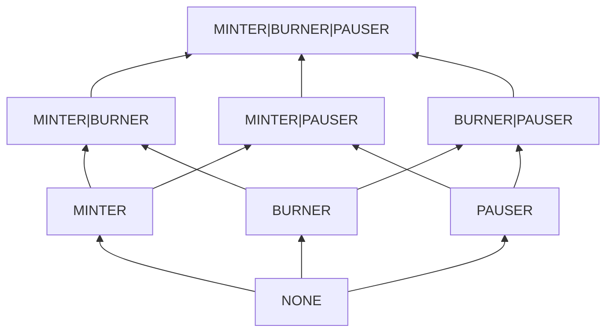

# Authority Module Suite

- [Authority Module Suite](#authority-module-suite)
  - [Singular Authentication](#singular-authentication)
  - [Multiple Authentication](#multiple-authentication)
    - [Linear Hierarchy](#linear-hierarchy)
    - [Role Power Set Hierarchy](#role-power-set-hierarchy)
  - [Temporal Authentication](#temporal-authentication)
    - [Timelock](#timelock)
    - [Lockdown](#lockdown)

This library contains a suite of extensible authentication modules for a variety of use cases.

Our key innovation is in lattice-based hierarchies of accounts. While this can cover all use cases
including single-account authorization schemes (`Ownable`, `Owned`, etc), it would likely be simpler
to use the [Singluar Authentication](#singular-authentication) contracts instead.

## Singular Authentication

The singular authentication contracts contain a single `admin` which can be transferred in a two
step process. The latter of the two supports ERC1967 administration:

- [`Administrated`](src/singular/Administrated.sol)
- [`Administrated1967`](src/singular/Administrated1967.sol)

## Multiple Authentication

Multiple authentication is encapsulated in a lattice-structure. For a deep dive into the fundamental
mathematics and the integration guide, see the [Lattices](Lattices.md) document.

In essence, accounts are paired with some level of authority, stored as a `uint256`. Accounts have
clearance for some authorized action based on whether or not they pass the `cleared` check:

```solidity
function cleared(address account, uint256 expectedAuthority) public view returns (bool);
```

### Linear Hierarchy

The linear hierarchical model uses a chain lattice whereby each account's `uint256` authority is
simply a number and an account has clearance over some `expectedAuthority` if their authority is
greater than or equal to it.

The administrator has the `type(uint256).max` authority.

Unauthorized accounts (default) have the `0` authority.

We can create chains of authority in this way:

```solidity
flowchart BT
    U("UNCLEARED")
    C("CONFIDENTIAL")
    S("SECRET")
    TS("TOP SECRET")

    U --> C --> S --> TS
```

### Role Power Set Hierarchy

The role power set hierarchical model uses a lattice whereby each account's `uint256` authority is a
256-bit bitmap and account has clearance over some `expectedAuthority` bitmap if and only if their
authority bitmap contains all non-zero bits in the `expectedAuthority` bitmap.

The administrator has the `type(uint256).max` authority.

Unauthorized accounts (default) have the `0` authority.

We can create complex webs of authority in this way:



## Temporal Authentication

Temporal authentication is a small collection of modules for time-locking certain actions.

### Timelock

The `Timelock` mechanism contains a `timelock` variable for queueing arbitrary actions to execute
only after the timelock has passed. Changes to the timelock must also be queued such that the
timelock can only be changed *after* the current timelock passes on this queue. Authenticating
which account may queue the timelock update is left to the implementor to enable a wide range of
authentication mechanisms; the implementor must only implement the following:

```solidity
function hasTimelockUpdateAuthority(address account) public view virtual returns (bool);
```

### Lockdown

The `Lockdown` mechanism is similar to `Pausable` but the lockdown only runs until an immutable
(set at deploy time) amount of time passes. However, once the lockdown duration passes, the account
which is authorized to initiate lockdown is disallowed from initiating lockdown again until an
amount of time equal to the lockdown duration has passed. This ensures the lockdown authorities do
not have an indefinite denial-of-service on the protocol. In the event of a protocol compromise, the
lockdown is intended to give users an exit window, not halt the protocol indefinitely. The
implementor must define the authentication mechanism with the following:

```solidity
function hasLockdownAuthority(address account) public view virtual returns (bool);
```
